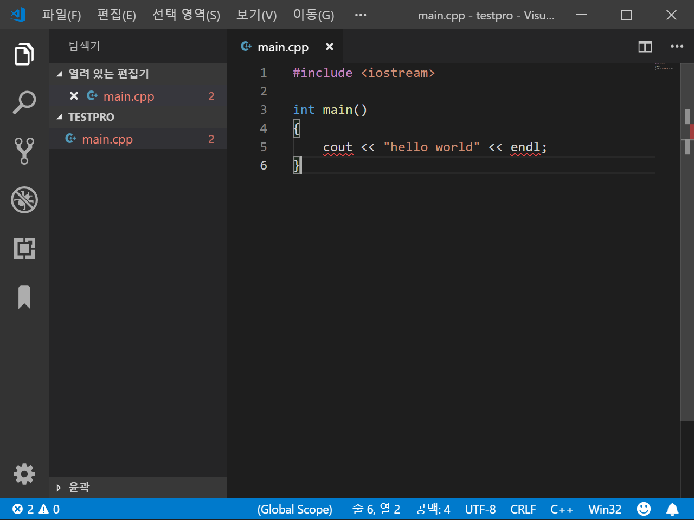

Cpp_VSCode_Debug
===

### MinGW 설치

[홈페이지](http://www.mingw.org/)

> mingw-get-setup.exe를 받으면 된다.


> 설치옵션은 위와 같이

Installation -> Apply Changes

---

### 환경변수 설정

`Path : C:\MinGW\bin` 추가

---

### VSCode에서 간단한 코딩을 해본다.

새로운 폴더 생성 후 아래코드 생성

```c
// main.cpp
#include <iostream>

int main()
{
    cout << "hello wordl" << endl;
}
```



> 다음과 같은 형태일 것

Ctrl+Shift+b 를 통해 빌드 시도 -> tasks.json을 others로 생성

```c
{
    // See https://go.microsoft.com/fwlink/?LinkId=733558
    // for the documentation about the tasks.json format
    "version": "2.0.0",
    "tasks": [
        {
            "label": "echo",
            "type": "shell",
            "command": "g++",
            "args": [
                "main.cpp"
            ]
        }
    ]
}
```

tasks.json을 위와 같이 변경 후 재 빌드


> 다음과 같은 경고창이 나오면 VSCode를껏다가 키자


> 잘 빌드된 모습

---

### .exe파일명 변경

```c
{
    // See https://go.microsoft.com/fwlink/?LinkId=733558
    // for the documentation about the tasks.json format
    "version": "2.0.0",
    "tasks": [
        {
            "label": "echo",
            "type": "shell",
            "command": "g++",
            "args": [
                "-o",
                "${fileBasenameNoExtension}.exe",
                "main.cpp"
            ],
            "group": {
                "kind": "build",
                "isDefault": true
            }
        }
    ]
}
```

task.json을 다음과 같이 수정 하고 ${fileBasenameNoExtension}에 원하는 파일명을 넣자

---

### 디버깅

```c
{
    // See https://go.microsoft.com/fwlink/?LinkId=733558
    // for the documentation about the tasks.json format
    "version": "2.0.0",
    "tasks": [
        {
            "label": "echo",
            "type": "shell",
            "command": "g++",
            "args": [
                "-g",
                "-o",
                "${fileBasenameNoExtension}.exe",
                "main.cpp"
            ],
            "group": {
                "kind": "build",
                "isDefault": true
            }
        }
    ]
}
```

task.json을 다음과 같이 수정, 달라진 점은 "-g"추가

F5를 누른다

환경선택에서 C++(GDB/LLDB)를 선택

```c
{
    // IntelliSense를 사용하여 가능한 특성에 대해 알아보세요.
    // 기존 특성에 대한 설명을 보려면 가리킵니다.
    // 자세한 내용을 보려면 https://go.microsoft.com/fwlink/?linkid=830387을(를) 방문하세요.
    "version": "0.2.0",
    "configurations": [
        {
            "name": "(gdb) Launch",
            "type": "cppdbg",
            "request": "launch",
            "program": "C:\\Users\\kimtaehyung\\Desktop\\testpro\\main.exe",
            "args": [],
            "stopAtEntry": false,
            "cwd": "${workspaceFolder}",
            "environment": [],
            "externalConsole": true,
            "MIMode": "gdb",
            "miDebuggerPath": "C:\\MinGW\\bin\\gdb.exe",
            "setupCommands": [
                {
                    "description": "Enable pretty-printing for gdb",
                    "text": "-enable-pretty-printing",
                    "ignoreFailures": true
                }
            ]
        }
    ]
}
```

launch.json을 다음과 같이 구성 -> 디버깅이 가능해진다.

---

### 참고사이트

* [사이트](https://evols-atirev.tistory.com/4?category=1003210)
